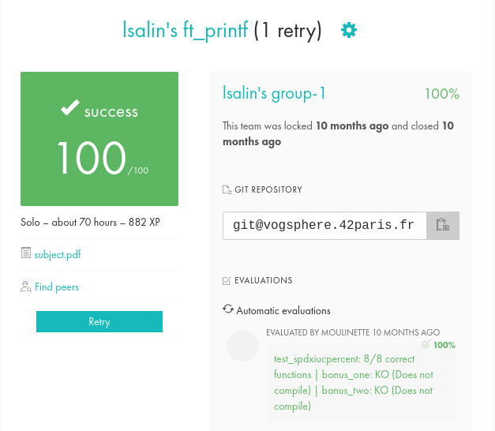

# ft_printf

🇫🇷

Ce projet consiste à recoder la fonction printf() de la bibliothèque standard C, dans le but de mieux comprendre son fonctionnement et d'apprendre à gérer un nombre variable d'arguments en C.

__Compétence acquise__ : fonctionnement des fonctions variadiques.

🇬🇧

This project consists in recoding the printf() function of the standard C library, in order to better understand its operation and to learn how to manage a variable number of arguments in C.

__Skill acquired__: operation of variadic functions.

